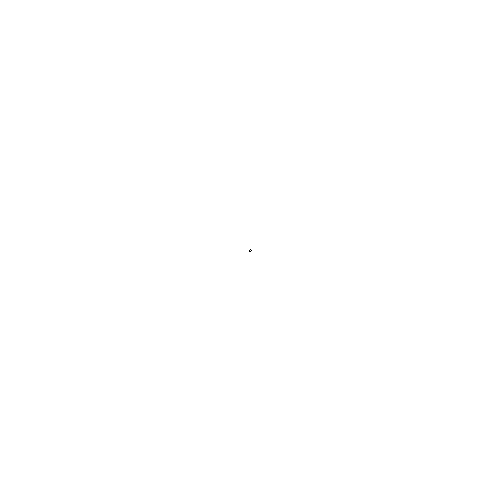
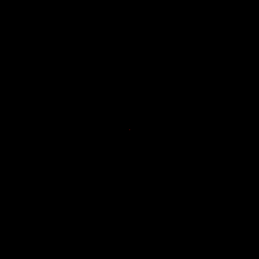
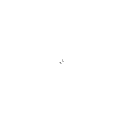
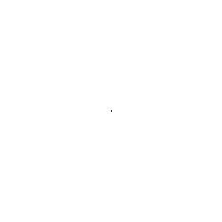

# Langtons-Ant-GUI
Python code to change multiple rules and simulation circumstances for Langton's Ant.

For More Information On Langton's Ant Visit:
https://en.wikipedia.org/wiki/Langton%27s_ant

